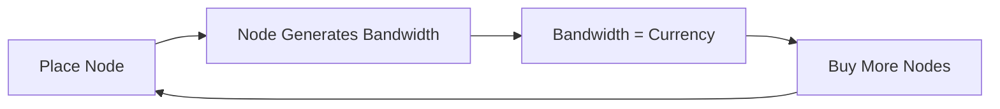

# Network Defense Game - Step-by-Step Godot Guide

## Core Game Loop (MVP Scope)



---

## Phase 1: Project Foundation (Steps 1-3)

### Step 1: Scene Structure Setup

- Create a **Main.tscn** scene as the game entry point
- Create a **GameWorld.tscn** scene that holds the grid and all nodes
- Set up a basic **Camera2D** that can pan around the world

**You will learn:** Scene tree basics, node hierarchy, camera controls

### Step 2: The Grid System  

- Create a visual grid using **TileMapLayer** or a custom **draw()** function
- Define grid cell size (e.g., 64x64 pixels)
- Convert mouse clicks to grid coordinates using `snapped()`

**You will learn:** Coordinate systems, input handling, grid snapping

### Step 3: Base Node Class

- Create `network_node.gd` as a base class extending **Area2D**
- Add core properties: `node_type`, `bandwidth_output`, `integrity`
- Create a simple visual (ColorRect or Sprite2D)

**You will learn:** Custom classes, exports, basic node composition

---

## Phase 2: Core Mechanics (Steps 4-6)

### Step 4: Host Node (The Generator)

- Extend base class to create `host_node.gd`
- Implement a **Timer** that ticks every second
- On each tick, emit a signal `bandwidth_generated(amount)`

**You will learn:** Timers, signals, the Godot event system

### Step 5: Game Manager (Singleton)

- Create `game_manager.gd` as an **Autoload** singleton
- Track `total_bandwidth` (your currency)
- Listen for `bandwidth_generated` signals from all Host nodes

**You will learn:** Autoloads, global state, signal connections

### Step 6: Basic UI

- Create **CanvasLayer** with a bandwidth counter label
- Add a simple "Buy Host" button
- Connect button to spawn a new Host node at cursor position

**You will learn:** UI nodes, Control hierarchy, button signals

---

## Phase 3: Connections and Polish (Steps 7-9)

### Step 7: Connection Lines

- Use **Line2D** nodes to draw "pipes" between connected nodes
- Store connections in an array on the parent node
- Update line positions when nodes are placed

**You will learn:** Line2D, dynamic drawing, parent-child relationships

### Step 8: Router Node (The Spawner)

- Create `router_node.gd` that can have "child slots"
- Host nodes must connect TO a Router
- Router limits how many Hosts can connect (start with 4 slots)

**You will learn:** Node relationships, constraints, game rules

### Step 9: Visual Feedback

- Add hover effects on nodes
- Show valid/invalid placement zones
- Simple particle effect when bandwidth is generated

**You will learn:** Input events, visual polish, particles

---

## Stretch Goals (Post-MVP)

These are for after the jam or if you have extra time:

- TOR/VPN nodes with special abilities
- The AI Firewall threat system
- DDoS attack mechanics
- Fog of war reveal system

---

## File Structure Preview

```
res://
  scenes/
    main.tscn
    game_world.tscn
    nodes/
      network_node.tscn
      host_node.tscn
      router_node.tscn
    ui/
      game_ui.tscn
  scripts/
    game_manager.gd
    network_node.gd
    host_node.gd
    router_node.gd
  assets/
    (sprites, fonts, etc.)
```

---

## How We Will Proceed

I will guide you through **one step at a time**. For each step:

1. I explain WHAT we're building and WHY
2. You create the files/scenes in Godot
3. I tell you exactly what code to write
4. You test it before moving on

**Ready to start with Step 1?** Say "Go" and I'll walk you through setting up the scene structure.